## **Proposta \- Sistema de Gerenciamento de Hotel**

## **1\. Dados da Empresa Desenvolvedora**

* **Nome da Empresa**: StayEasy Solutions;  
* **CNPJ**: 466.484.82/0001-91;  
* **Endereço**: Rua Issao Nakamura, 157 \- Viva Olimpia, Olímpia-SP, 15407-598;  
* **Contato**: Matheus B., (11) 97717-1661;

## **2\. Dados da Empresa Cliente**

* **Nome da Empresa**: Agência de Viagens e Turismo Mazitur LTDA;  
* **CNPJ**: 52.892.110/0001-09;  
* **Endereço**: Rua Dois, 330 \- Centro, Altair- SP, 15430-000;  
* **Contato**: (17) 99765-8060;

## **3\. Obrigações da Desenvolvedora**

 **Módulo da Tela Inicial:**

Tela inicial composta pelos seguintes módulos: Navbar, Início, Quartos, Serviços, Sobre e Contato.

* **Navbar**: Exibe o nome e a logo do hotel, com botões para Início, Quartos, Serviços, Sobre, Contato e Login (que direciona para a tela de gerenciamento);  
* **Início**: Apresenta uma mensagem de boas-vindas e um link para reservas;  
* **Quartos**: Exibe descrições, fotos básicas e características dos quartos;  
* **Serviços**: Mostra de forma simples os serviços oferecidos pelo hotel, desde alimentação até entretenimento;  
* **Sobre**: Fornece informações básicas sobre a localização e o hotel;  
* **Contato**: Disponibiliza opções para que o usuário entre em contato diretamente;  
* **Rodapé**: Contém informações de direitos autorais;

O botão de Login na Navbar abre uma tela para inserir usuário e senha, com opção para registro, que leva a um formulário para cadastro com nome, e-mail, senha e telefone.

 **Imagens tela inicial:**  
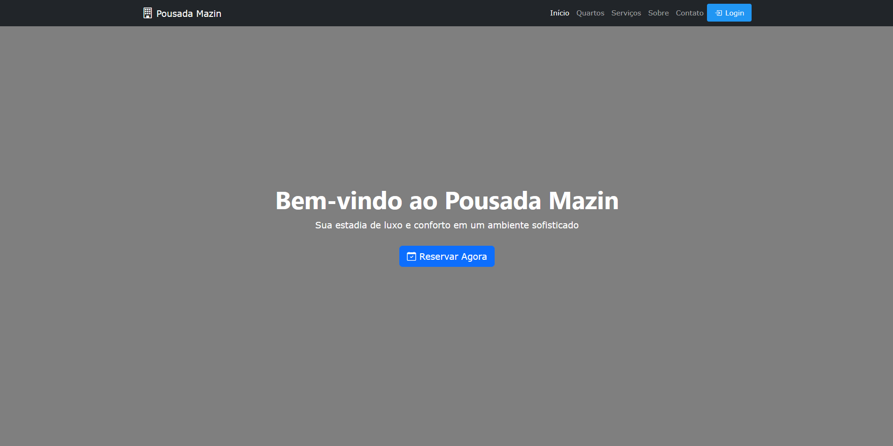
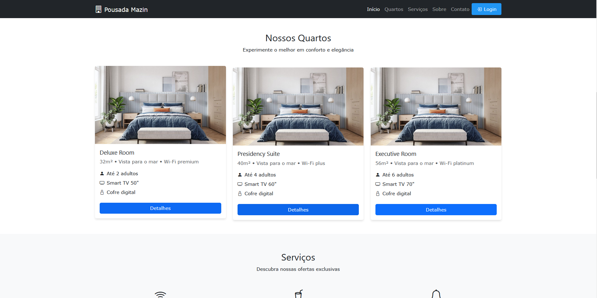
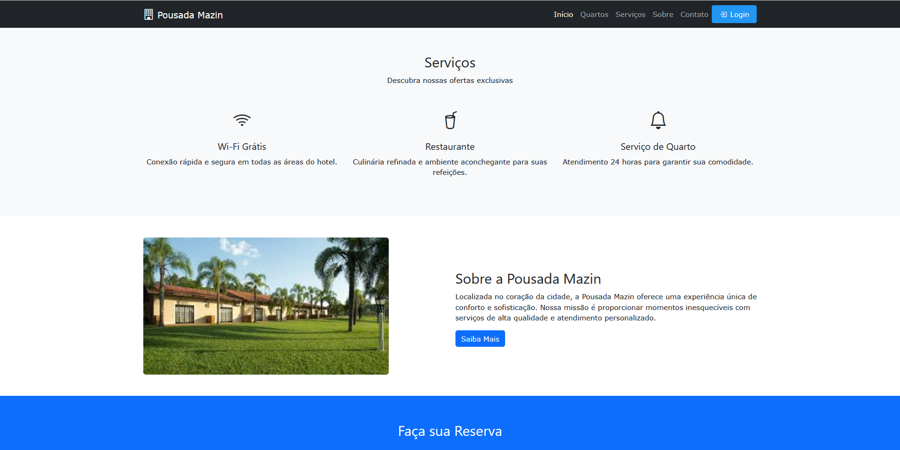
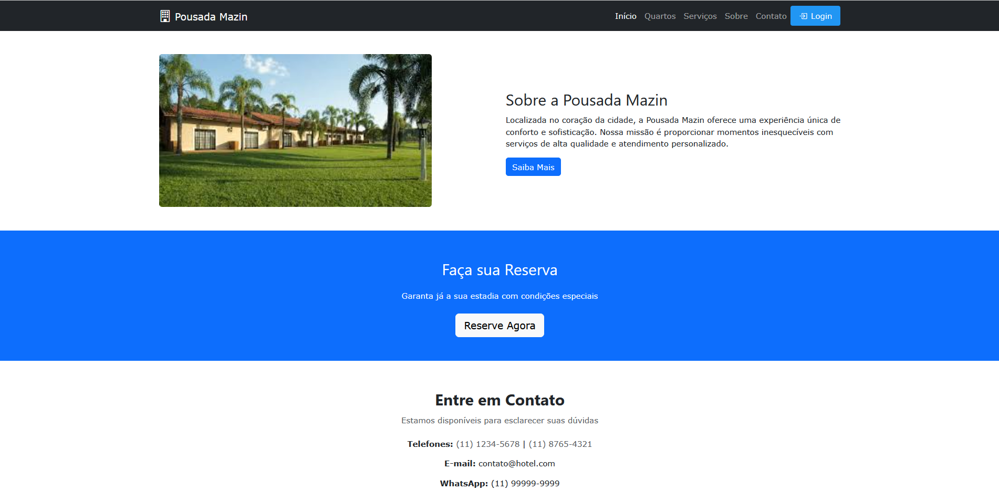

 **Módulo de Reserva da Tela Inicial:**

Quando o cliente clica em um botão de Reserva na tela inicial, ele é direcionado para uma página onde pode visualizar os quartos disponíveis para uma data específica, que ele pode selecionar. Nesta tela, cada quarto é apresentado com uma descrição básica, fotos e um botão "Reservar".

Ao clicar no botão "Reservar" de um quarto específico, o cliente é levado para uma tela onde deverá informar o Nome, E-mail, e as datas de Check-in e Check-out previamente selecionadas. Após preencher esses dados e clicar no botão "Reservar", a reserva é efetivada automaticamente.

 **Fotos de Reserva da Tela Inicial:**

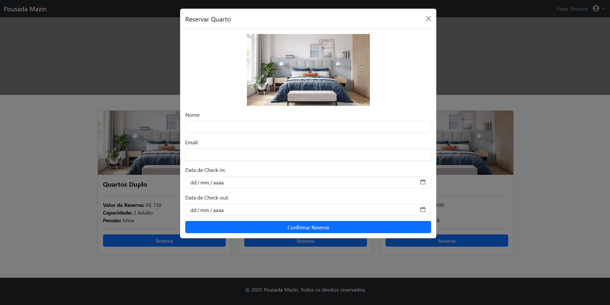 
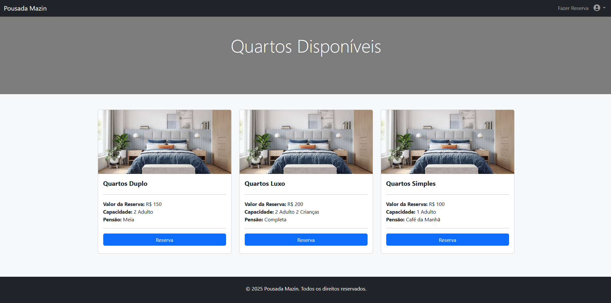

**Módulo de Gerenciamento para o Cliente**

Após finalizar a reserva, o cliente pode realizar o login no sistema, utilizando a mesma aba que os funcionários. Na tela "Minhas Reservas", há:

* **Navbar Básica**: Exibe o nome do hotel, um botão para criar uma reserva e um botão de perfil;  
* **Lista de Reservas**: Exibe as reservas realizadas pelo cliente, apresentando:

  * Número do quarto;  
  * Status da reserva;  
  * Foto do quarto;  
  * Valor e tipo do quarto;  
  * Data de check-in e check-out;  
  * Um botão para confirmar a reserva;  
  * Indicação de quem criou a reserva;

 **Fotos da tela de gerenciamento para o cliente**

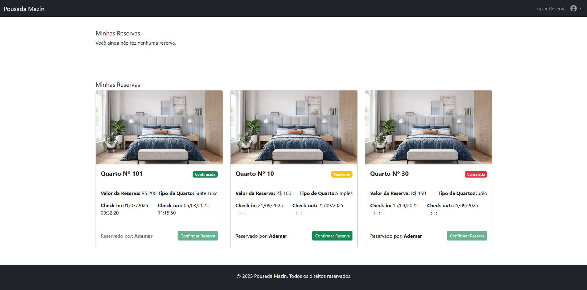

 **Módulo de Gerenciamento de Funcionários**

Ao acessar o sistema, é exibida a página de gerenciamento de funcionários da Pousada Mazin. Nesta tela, encontra-se:

* **Navbar Padrão**: Exibe o logotipo da “Pousada Mazin”, acompanhada de um menu hambúrguer e um ícone de usuário;  
* **Título da Página**: “Funcionários da Pousada Mazin”;  
* **Campo de Busca e Cadastro**: Logo abaixo do título, há um campo de busca e um botão para “Cadastrar Novo Funcionário”. Ao clicar, o usuário é direcionado para um formulário que solicita Nome, Email, Cargo e Telefone (o Id é gerado automaticamente);  
* **Tabela de Funcionários**: A página apresenta uma tabela listando os funcionários, com colunas para Id, Nome, Email, Cargo e Telefone, e um botão para editar os dados de cada registro;

 **Imagens da tela de gerenciamento de funcionários:**

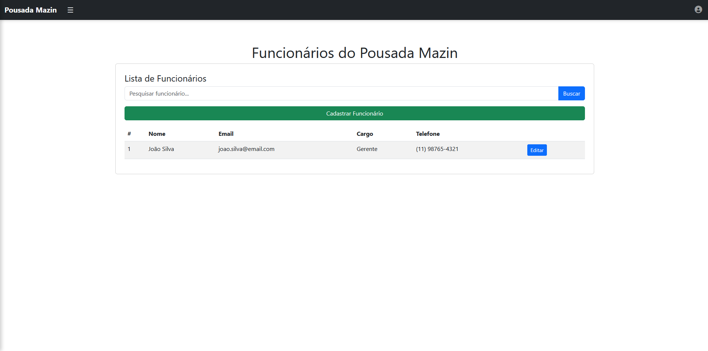
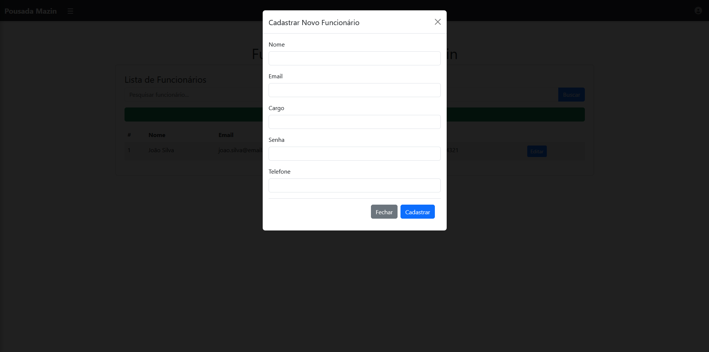
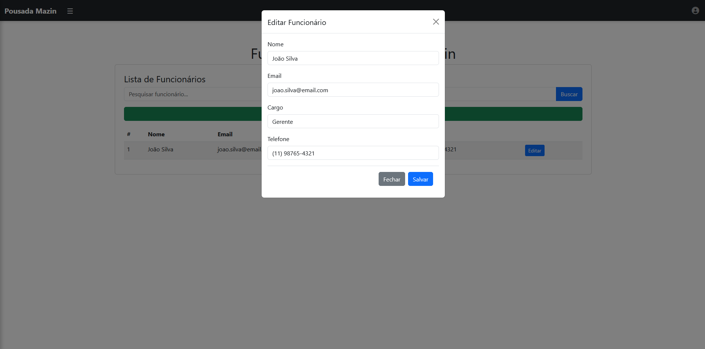

**Módulo de gerenciamento de quartos:**  
**Tela Principal – Gerenciar Quartos**

* Exibe a mesma navbar padrão no topo, com logotipo, menu hambúrguer e ícone de usuário;  
* Apresenta o título “Gerenciar Quartos”;  
* Exibe um campo de pesquisa com botão de buscar;  
* Acima da tabela, há um botão “Cadastrar Novo Quarto”;  
* A tabela lista os quartos existentes com as colunas: Número do Quarto, Tipo, Preço da Diária, Descrição e Capacidade. Cada linha contém também um botão para editar o respectivo quarto;

**Tela de Cadastro – Adicionar Novo Quarto**

* Exibe a mesma navbar padrão com o título “Adicionar Novo Quarto”;  
* Possui campos para inserir: Número do Quarto, Tipo, Preço por Noite e Descrição.  
* Inclui um botão para definir se deseja aplicar um limite de hóspedes; caso selecionado, surgem opções para informar a quantidade de adultos e crianças;  
* Apresenta uma seção para envio de imagens do quarto;  
* Ao final, há os botões “Adicionar” e “Voltar”;

**Tela de Edição – Editar Quarto**

* É praticamente idêntica à tela de cadastro, porém carrega os dados existentes do quarto para modificação;  
* O título da página é “Editar Quarto” e o botão de ação exibe “Salvar” em vez de “Adicionar”;

**Fotos da tela de Gerenciamento de quartos:**

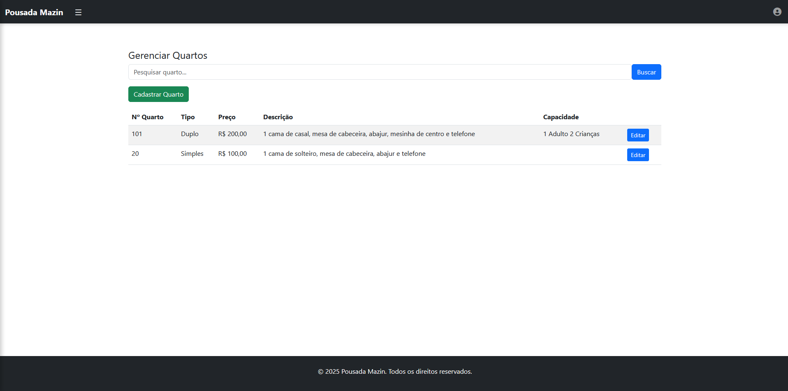
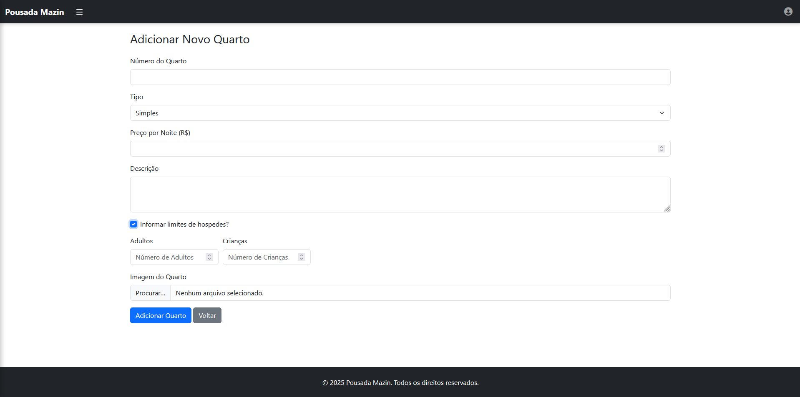
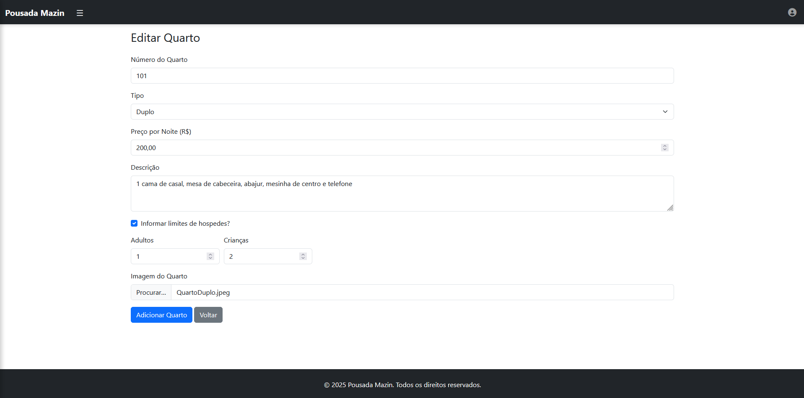

**Módulo de Gerenciamento de Reservas**

* Exibe a navbar padrão no topo;  
* Apresenta o título “Gerenciar Reservas”;  
* Contém um campo de pesquisa com botão de buscar;  
* Possui um botão para “Cadastrar Reserva”;  
* Abaixo, uma tabela lista as reservas existentes. Cada registro inclui:

  * Um checkbox para seleção (permitindo alteração em massa do status);  
  * Um botão para lançar um Serviço de Quarto;  
  * Um botão para editar a Reserva.

**Cadastro de Reserva**

* Exibe a mesma navbar padrão com o título “Cadastrar Reserva”;  
* Possui campos para inserir:

  * Nome do Cliente;  
  * Seleção do Quarto;  
  * Data e horário de Check-in e Check-out, com indicação do horário limite para ambos;  
  * Valor Total da Reserva;  
  * Tipo de Pensão;  
  * Observações sobre a Reserva.

**Edição de Reserva**

* Apresenta uma interface simples;  
* Permite alterar o Valor, o Tipo de Pensão e as Observações;  
* Não é possível alterar o Nome, nem as datas de Check-in e Check-out.

**Solicitação de Serviço de Quarto**

* É uma tela padrão de cadastro;  
* Solicita a descrição do serviço;  
* Contém um checkbox que, se selecionado, exibe um campo para inserir um valor adicional;  
* Exibe, abaixo, uma lista de pedidos ativos.

**Imagens da tela de gerenciamento de reservas:**  
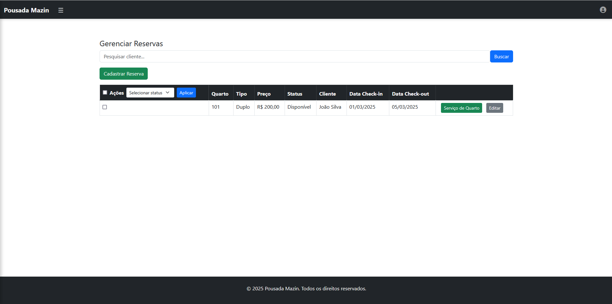
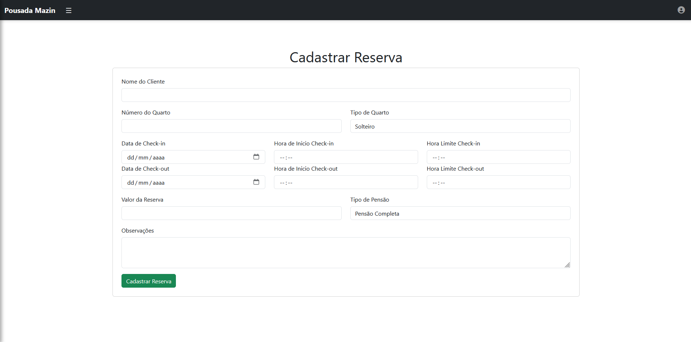
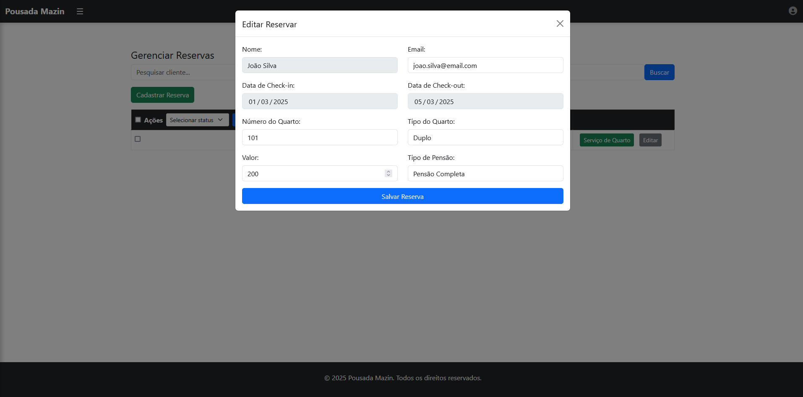
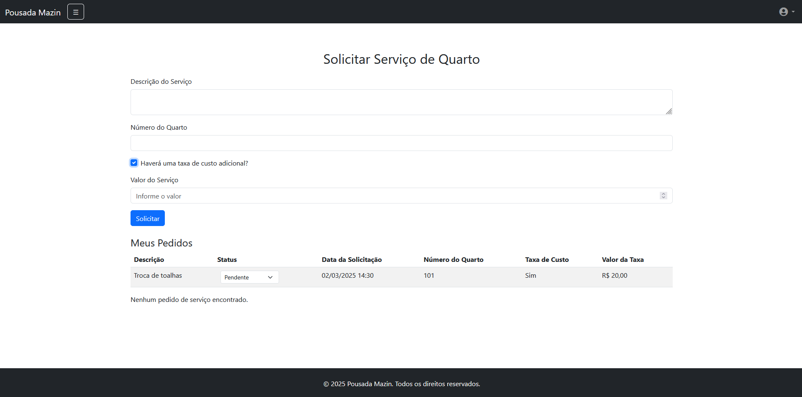

**Módulo de Gerenciamento de Baixa de Pagamento**

* **Navbar Padrão de Gerenciamento**: Exibe os controles comuns do sistema na parte superior;  
* **Título da Página**: “Baixa de Pagamento”;  
* **Barra de Pesquisa**: Logo abaixo do título, permite pesquisar pagamentos;  
* **Tabela de Pagamentos**: Lista os pagamentos a serem processados, com as seguintes colunas:

  * Código do Pagamento;  
  * Número do Quarto;  
  * Cliente;  
  * Tipo do Quarto;  
  * Tipo de Pagamento;  
  * Data da Baixa;  
  * Data do Recebimento;  
  * Valor;  
  * Botão “Baixar”.

* **Ação do Botão “Baixar”**: Ao clicar, é exibida uma tela de confirmação para validar a ação de baixa do pagamento.

**Imagens da tela de gerenciamento de baixas:**

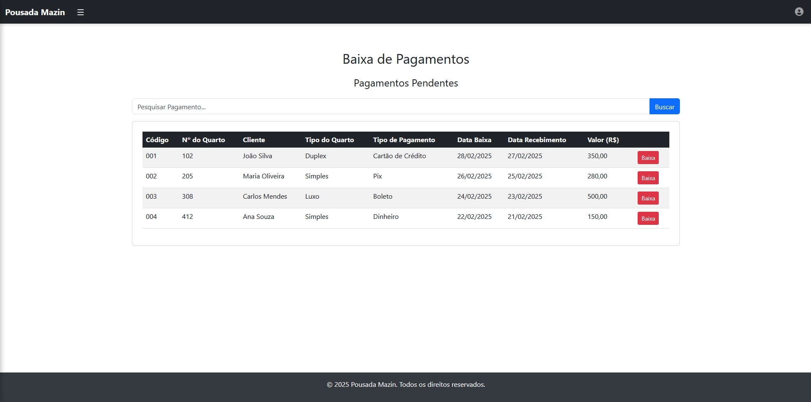
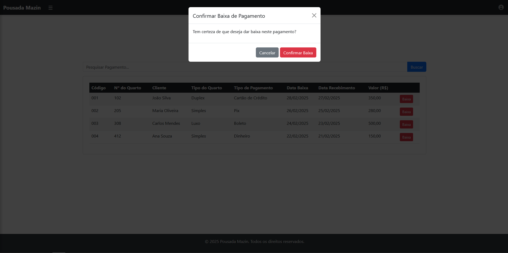

**Navbar Padrão de Gerenciamento (após o login)**

 **Botão de Usuário**:

* Ao clicar, exibe uma janela com os dados do usuário: nome, e-mail e tipo de usuário. Nessa janela, há dois botões:

  * **Trocar Senha**: Abre um formulário que solicita a senha atual e a nova senha digitada duas vezes;  
  * **Sair**: Redireciona para o Menu Inicial.

 **Botão do Menu Lateral**:

* Abre um menu lateral com as seguintes opções:

  * Gerenciar Quartos;  
  * Gerenciar Reservas;  
  * Gerenciar Funcionários;  
  * Baixas de Pagamento.

Cada opção direciona para sua respectiva tela de gerenciamento, conforme descrito anteriormente.

Há também um botão no topo do menu lateral para fechá-lo.

 **Imagens da navbar:**

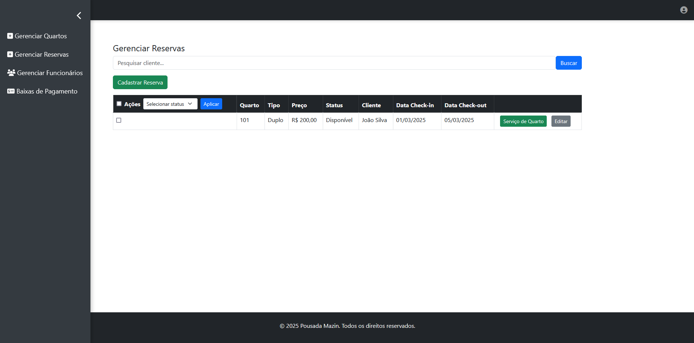
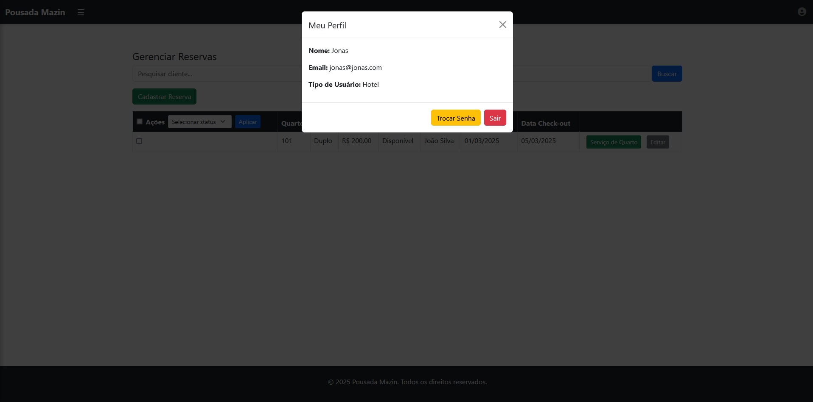
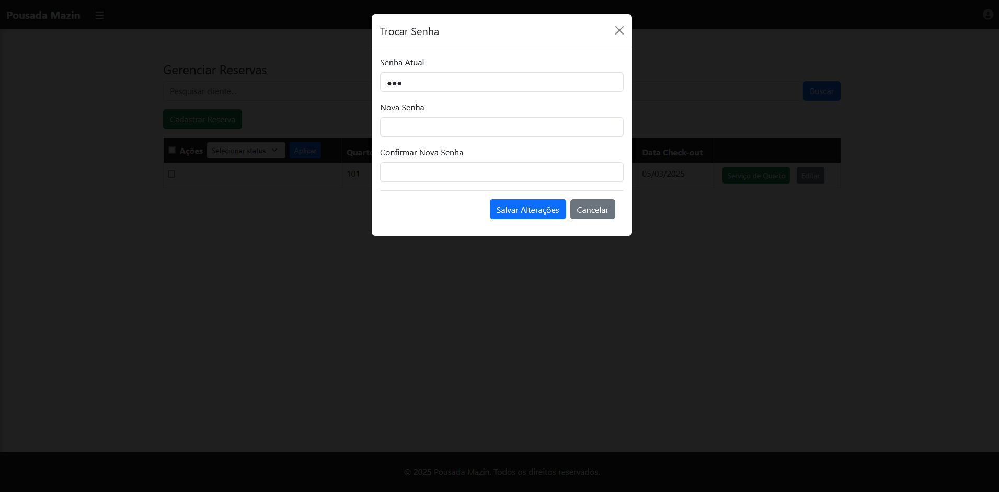

* **Detalhes Importantes**:\*

  * **Implantação**: O sistema será implantado em plataforma web e desenvolvido em linguagem PHP com banco de dados MySQL.  
  * **Tecnologias**:\*

    * **Linguagem de Programação**: PHP;  
    * **Banco de Dados**: MySQL;  
    * **Framework**: Bootstrap.

## 

## 

## 

## **4\. Obrigações do Cliente**

* **Fornecer**:

  * Logotipo da empresa em alta resolução;  
  * Informações sobre os produtos a serem cadastrados no sistema;  
  * Layout do comprovante de venda (caso possua um modelo específico);  
  * Acesso à infraestrutura de TI para implantação do sistema.

* **Participar**:

  * Reuniões de planejamento e acompanhamento do projeto;  
  * Testes do sistema antes da implantação;  
  * Treinamento dos usuários do sistema.

## **5\. Valor a Pagar e Formas de Pagamento**

* **Desenvolvimento do Sistema**: R$ 9.600,00;  
* **Implantação e Treinamento**: R$ 2.500,00;  
* **Análise e Planejamento**: R$ 1.600,00;  
* **Suporte Técnico (opcional)**: R$ 500,00 mensal;  
* **Total**: R$ 13.700,00;  
* **Formas de Pagamento:** Pix, crédito e débito.

## **6\. Prazo de Entrega**

* **Prazo estimado**: 12 semanas, a partir da assinatura do contrato e do cumprimento das obrigações do cliente.

## **Observações**

* Esta proposta é válida por sete dias;  
* Os valores apresentados são estimativas e podem ser ajustados após análise detalhada dos requisitos do cliente;  
* O sistema poderá ser personalizado de acordo com as necessidades específicas do cliente, mediante orçamento adicional.

**Agradecemos o seu interesse em nossos serviços\!**

**Atenciosamente,**

StayEasy Solutions

11/03/2025, Olimpia-SP

\_\_\_\_\_\_\_\_\_\_\_\_\_\_\_\_\_\_\_\_\_\_\_\_\_\_\_\_\_\_\_\_\_\_\_\_\_\_\_\_\_\_\_\_\_\_\_\_\_\_\_\_\_\_  
**MATHEUS BRITO SAMPAIO(CTO)**  
**DESENVOLVEDORA**

\_\_\_\_\_\_\_\_\_\_\_\_\_\_\_\_\_\_\_\_\_\_\_\_\_\_\_\_\_\_\_\_\_\_\_\_\_\_\_\_\_\_\_\_\_\_\_\_\_\_\_\_\_\_  
**AGÊNCIA DE VIAGENS E TURISMO MAZITUR LTDA(CEO)**  
**CONTRATANTE**

